# ATL 1

# Kalorien-Tracker

# ```bash ist da um den code/gewisse Abschnitte hervorzuheben

## Was macht die App?

Der Kalorien-Tracker ist dafür da, das tägliche Kalorienziel zu berechnen und zu tracken. Man gibt seine eigenen Daten ein, Grösse, Gewicht, Geschlecht, Zielgewicht und Aktivitätslevel, und das tägliche Kalorienziel wird automatisch berechnet. Für einzelne Lebensmittel wie Poulet, Reis oder Nudeln trägt man den Namen und die Nährwerte ein. Diese werden dann in Mahlzeiten zusammengefasst und vom täglichen Ziel abgezogen, damit man weiss, wo man am Tagesbedarf steht.

Die App richtet sich an Leute, die auf einfachem Weg ihren täglichen Kalorienbedarf tracken und abnehmen möchten, ohne ein kostenpflichtiges Abo abschliessen zu müssen.

Der Ursprung war ein einfaches Terminal-Script, das die Berechnungslogik (BMR/GSU nach Harris-Benedict) bereits enthielt. Von dort aus wurde die App zu einer vollständigen REST-API weiterentwickelt.


## Verwendete Technologien
- **Python 3.12**           —   Programmiersprache
- **FastAPI**               —   Web-Framework für die REST-API
- **SQLModel**              —   ORM für Datenbankzugriff zwischen Datenbank und Python
- **SQLite**                —   Lokale Datenbank
- **PyJWT**                 —   JWT-Authentifizierung
- **pytest / pytest-cov**   —   Tests und Coverage-Analyse
- **uv**                    —   Dependency-Management
- **Docker**                —   Containerisierung
- **Google Cloud Build**    —   CI/CD Pipeline

## Projektstruktur
app/

├── models/       # Datenbankmodelle — definieren wie Daten in SQLite gespeichert werden

├── schemas/      # Pydantic-Schemas — definieren was die API empfängt und zurückgibt (create & public)

├── services/     # Geschäftslogik — Berechnungen, Datenbankoperationen (Code Logik von der Terminal version)

├── routers/      # API-Endpunkte — nehmen Requests entgegen und leiten sie an Services

extras:

├── tests/        # Automatisierte Tests (pytest, 93% Coverage)

├── database.py   # Datenbankverbindung und Session-Management

├── security.py   # JWT-Authentifizierung (Token prüfen)

├── main.py       # App-Einstiegspunkt — registriert alle Router

└── terminal.py   # Ursprüngliches Terminal-Script (Ausgangsbasis der Logik)

Die Architektur folgt dem Prinzip der Schichtentrennung, jede Schicht hat genau eine Aufgabe und kommuniziert nur mit der direkt benachbarten Schicht:
Request → Router → Service → Model → Datenbank

### Übersicht aller Endpunkte in Swagger

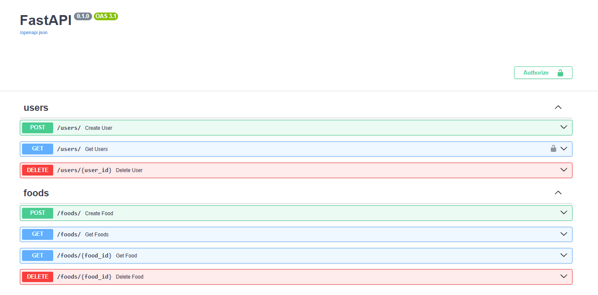
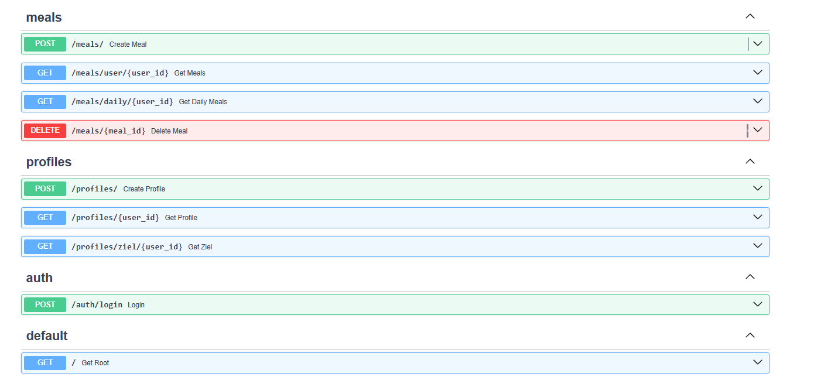

Die automatisch generierte Swagger-Dokumentation zeigt alle 14 Endpunkte gruppiert nach Bereich. Das Schloss-Symbol
bei `GET /users/` zeigt an, dass dieser Endpunkt durch JWT-Authentifizierung geschützt ist.

## Installation & Starten

### Voraussetzungen
- Python 3.12
- [uv](https://docs.astral.sh/uv/) installiert

### Installation

### Repository klonen
git clone https://github.com/BurkayTunc28/Kalorien-Tracker.git

### Abhängigkeiten installieren
uv sync

### Starten
uv run fastapi dev app/main.py

Die API ist danach erreichbar unter:
- **API:** http://127.0.0.1:8000
- **Swagger UI (Dokumentation & Testen):** http://127.0.0.1:8000/docs


## Verwendung

### Typischer Ablauf

**1. User registrieren**
```bash
POST /users/
{
  "email": "deine@email.ch",
  "password": "passwort"
}
```

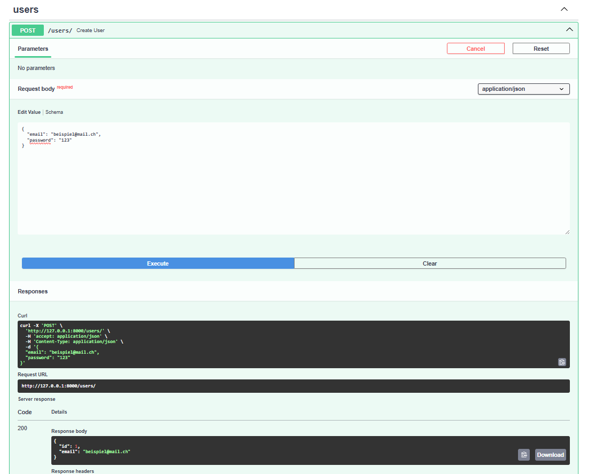

Die Antwort enthält nur `id` und `email` — das Passwort wird nie zurückgegeben,
auch wenn es im Request mitgeschickt wurde.

**2. Einloggen & Token holen**
```bash
POST /auth/login
{
  "email": "deine@email.ch",
  "password": "passwort"
}
```
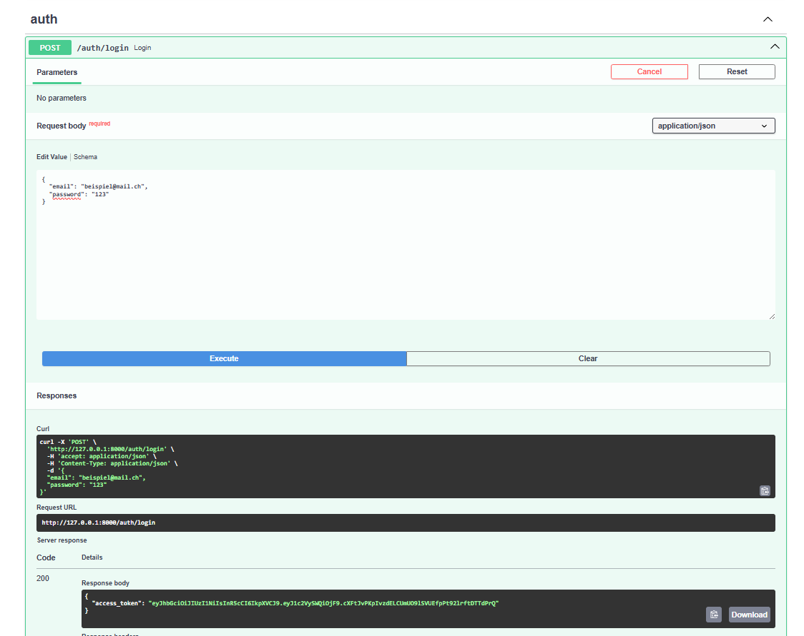

Bei korrekten Daten wird ein `access_token` zurückgegeben (JWT). Bei falschem Passwort
kommt stattdessen ein `401 Unauthorized`:

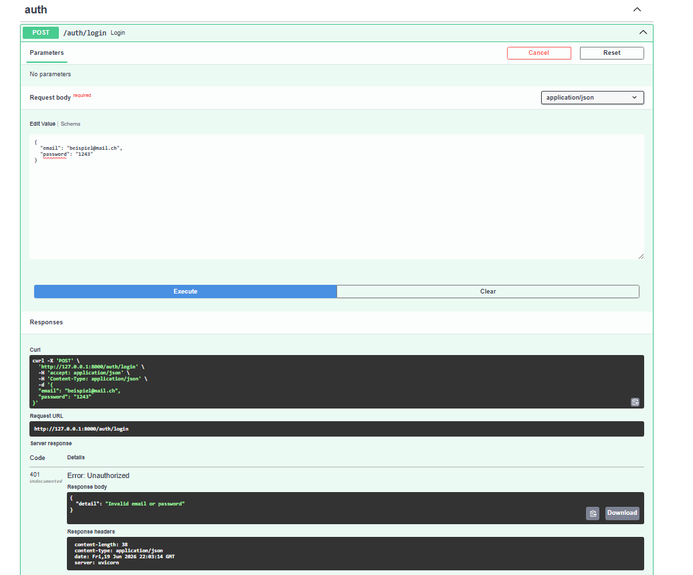

Den Token kopiert man und trägt ihn oben rechts unter "Authorize" ein:

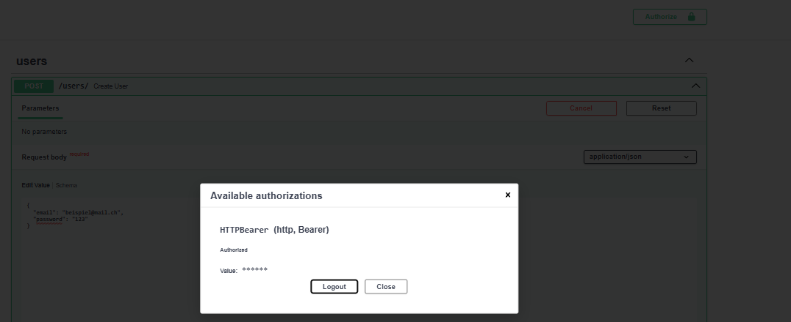

Ab jetzt sind alle geschützten Endpunkte (z.B. `GET /users/`) freigeschaltet.

**3. Profil erstellen**
```bash
POST /profiles/
{
  "user_id": 1,
  "gewicht": 110,
  "zielgewicht": 90,
  "groesse": 172,
  "alter": 26,
  "geschlecht": "m",
  "aktivitaet": 1
}

```
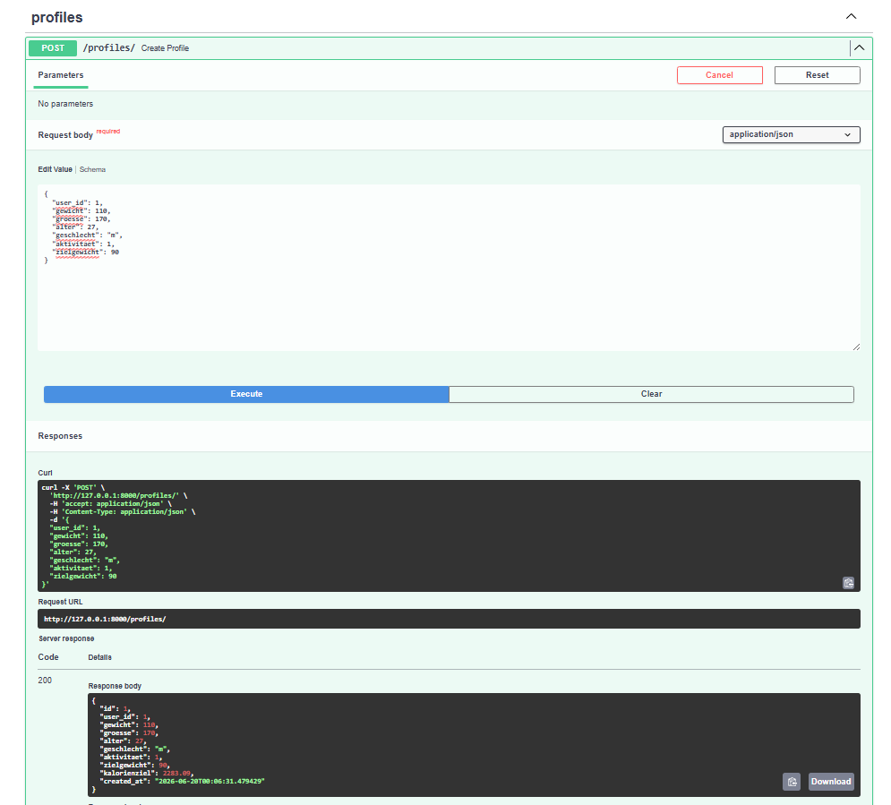

`kalorienziel` wird automatisch berechnet (BMR → GSU → -15% Defizit) und in der
Antwort zurückgegeben, der User gibt diesen Wert nirgends selbst ein.


**4. Lebensmittel erfassen**
```bash
POST /foods/
{
  "name": "Poulet",
  "menge_gramm": 100,
  "kalorien": 165,
  "protein": 31,
  "kohlenhydrate": 0,
  "fett": 3.6
}
```

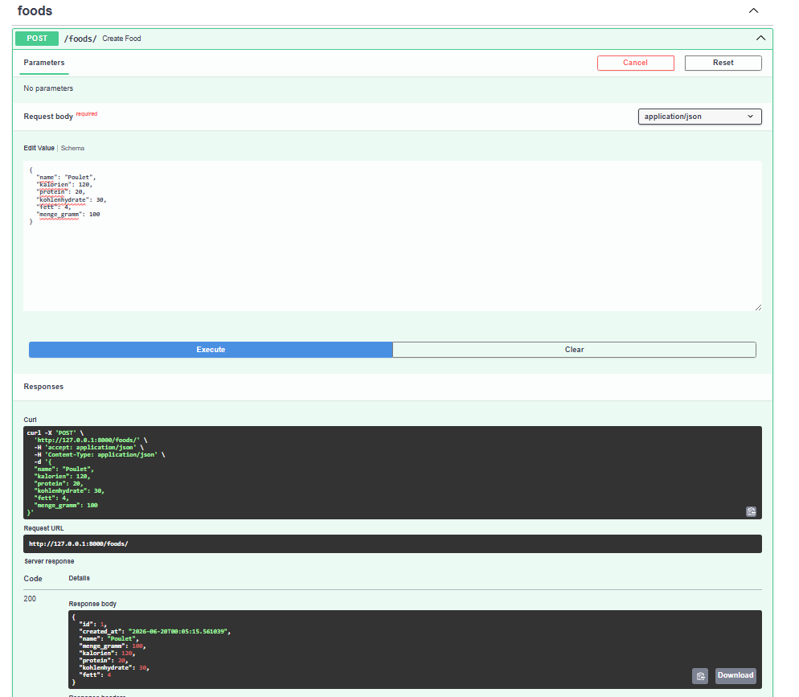

`menge_gramm` definiert auf welche Menge sich die Nährwerte beziehen, meist 100g,
kann aber auch eine andere Referenzmenge sein (z.B. 30g für eine Portion).


**5. Mahlzeit erfassen**
```bash
POST /meals/
{
  "user_id": 1,
  "food_id": 1,
  "menge": 200,
  "name": "Mittagessen"
}

```
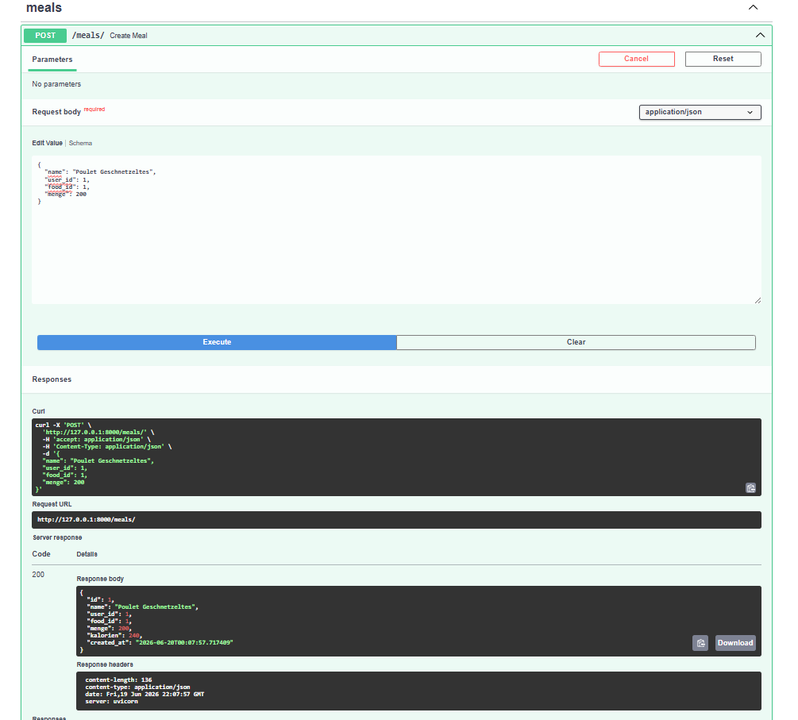

Die Kalorien werden automatisch berechnet: `(menge / menge_gramm) * kalorien`.
Bei 200g Poulet (120 kcal/100g) ergibt das 240 kcal.

**6. Tagesübersicht abrufen**
```bash
GET /meals/daily/1
```
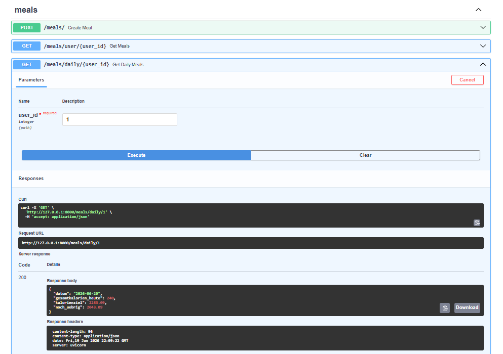

Zeigt: heute gegessene Kalorien, das Kalorienziel aus dem Profil, und wie viel noch übrig ist.
Diese Übersicht summiert automatisch alle Mahlzeiten des aktuellen Tages.


**7. Zielgewicht-Berechnung**
```bash
GET /profiles/ziel/1
```
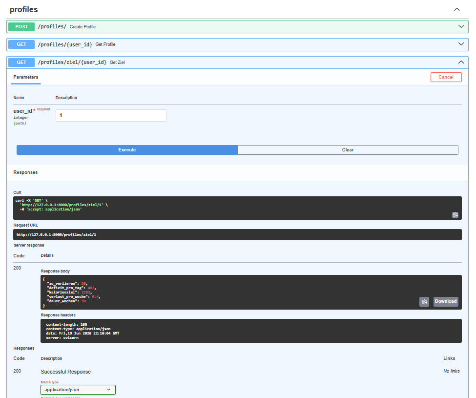

Zeigt wie viel Gewicht noch zu verlieren ist, das empfohlene tägliche Defizit, und die geschätzte Dauer in Wochen bis zum Zielgewicht.

### Alle Endpunkte

- `POST /users/` — User registrieren
- `POST /auth/login` — Einloggen, Token erhalten
- `GET /users/` — Alle User abrufen (Token nötig)
- `POST /foods/` — Lebensmittel erfassen
- `GET /foods/` — Alle Lebensmittel abrufen
- `GET /foods/{id}` — Ein Lebensmittel abrufen
- `DELETE /foods/{id}` — Lebensmittel löschen
- `POST /meals/` — Mahlzeit erfassen
- `GET /meals/user/{user_id}` — Alle Mahlzeiten eines Users
- `GET /meals/daily/{user_id}` — Tagesübersicht
- `DELETE /meals/{id}` — Mahlzeit löschen
- `POST /profiles/` — Profil erstellen
- `GET /profiles/{user_id}` — Profil abrufen
- `GET /profiles/ziel/{user_id}` — Zielgewicht-Berechnung

### Was ist der Unterschied zwischen den GET-Endpunkten?

Diese Endpunkte noch konkreter erklärt:

- `GET /meals/user/{user_id}` — Alle Mahlzeiten aller Zeit (Historie)
- `GET /meals/daily/{user_id}` — Nur heutige Mahlzeiten + Vergleich mit Kalorienziel
- `GET /profiles/{user_id}` — Gespeicherte Profildaten unverändert anzeigen
- `GET /profiles/ziel/{user_id}` — NEUE Berechnung: Wochen bis Zielgewicht


## Tests

### Ausführen

Alle Tests wurden mit Intregations Testing getetestet, um die beziehungen zu einander auch wirklich zu überprüfen um nicht
einfach für eine bestimmte angabe/resultat getestet zu sein.

```bash
# Alle Tests
uv run pytest

# Mit Coverage-Bericht
uv run pytest --cov=app --cov-report=term-missing

# Einzelne Testdatei
uv run pytest app/tests/test_profiles.py -v
```

### Aktuelle Coverage: 93%

- **models/** — 100%
- **schemas/** — 100%
- **security.py** — 100%
- **routers/** — 88-100%
- **services/profile.py** — 87%
- **services/auth.py** — 91%
- **services/food.py** — 85%
- **services/meal.py** — 74%
- **services/user.py** — 77%

Services wurden hier genauer unterteilt, da die meiste Code Logik hier ist und diese dementsprechend getestet wurde.

### Was wird getestet

- **test_users.py** — User erstellen, doppelte Email, fehlendes Passwort
- **test_auth.py** — Login, falsches Passwort, JWT-Schutz
- **test_foods.py** — Lebensmittel erstellen, abrufen, löschen, 404
- **test_profiles.py** — BMR/GSU-Formel prüfen ob sie klappt, Zielgewicht-Berechnung
- **test_meals.py** — Kalorienberechnung, Tagessumme, löschen

## Überlegungen während der Entwicklung

### Von Terminal zu API
Der Ausgangspunkt war eine einfache Terminal Version (`terminal.py`) das Gewicht, Grösse, Alter und Aktivitätslevel
per `input()` abfragt und daraus den Kalorienbedarf berechnet. Das Ziel war, diese Logik in eine echte REST-API zu
überführen, ohne die Berechnungsformeln zu verändern, nur die Ein- und Ausgabe zu ersetzen: statt `input()` kommen
die Daten jetzt aus dem HTTP-Request-Body, statt `print()` gibt es eine JSON-Response.

### Schichtentrennung (models/schemas/services/routers)
Von Beginn an war klar, dass der Code sauber getrennt sein soll. Jede Schicht hat genau eine Aufgabe:
-Models definieren die Datenbankstruktur
-Schemas validieren was rein- und rausgeht,
-Services enthalten die Logik,
-Routers nehmen Requests über HTTP entgegen.
Das macht den Code nachvollziehbar und erweiterbar, eine neue Funktion
kann hinzugefügt werden ohne bestehende Schichten anzufassen und der Code ist dementsprechend auch lesbarer/nachvollziehbarer.

### Kalorienberechnung über Referenzmenge
Lebensmittel haben unterschiedliche Referenzmengen, Poulet wird typischerweise pro 100g angegeben,
ein Müsliriegel pro Portion (z.B. 30g). Deshalb wurde das Feld `menge_gramm` eingeführt, das flexibel
definiert werden kann. Die Berechnung `(menge / menge_gramm) * kalorien` funktioniert für beide Fälle korrekt
für die Meal berechnung.

### Kalorienziel automatisch berechnet
Das Kalorienziel wird nicht manuell eingegeben, sondern beim Erstellen des Profils automatisch
berechnet: BMR (Grundumsatz nach Harris-Benedict) × PAL-Faktor (Aktivitätslevel) = GSU (Gesamtumsatz),
davon 15% Defizit = tägliches Kalorienziel. Das ist medizinisch fundiert und verhindert ein zu grosses
Kaloriendefizit und erlaubt ein gesundes Abnehmen.

### JWT-Authentifizierung
Damit nicht jeder auf alle Daten zugreifen kann, wurde JWT (JSON Web Token) eingebaut. Nach dem Login erhält
der User einen Token der bei geschützten Endpunkten mitgeschickt wird. Der Server prüft den Token und weiss
damit wer der User ist, ohne jedes Mal das Passwort zu übertragen.


## Was ich noch verbessern würde

### Mehrere Lebensmittel pro Mahlzeit
Aktuell besteht eine Mahlzeit immer aus genau einem Lebensmittel. Ein realistisches Gericht wie
"Poulet mit Reis und Salat" müsste als drei separate Mahlzeiten eingetragen werden.
Mit mehr Zeit und Verständniss für die Komplexität hätte ich eine "MealItem"-Zwischentabelle eingeführt:

Meal (Name, Datum, User)
─ MealItem 1: Poulet, 200g
─ MealItem 2: Reis, 100g
─ MealItem 3: Salat, 50g

Die Kalorienberechnung würde dann die Summe aller Items ergeben.

### Food Datenbank
Eventuell eine Verkpüfung mit einer Datenbank, die allgemeine Infos zu Lebensmittel hätten, damit man die
Kalorien, Proteine, Kohlenhydrate nicht immer separat eingeben muss, wenn man es in der Datenbank finden kann.

### Monatsübersicht
Aktuell gibt es nur eine Tagesübersicht. Eine Monatsübersicht wäre technisch einfach umzusetzen
(gleiche Logik wie `get_daily_meals`, nur mit Monatsfilter statt Tagesfilter) und würde einen
besseren Überblick über längere Zeiträume geben.

### Benutzeroberfläche
Die App ist aktuell nur über die Swagger UI oder direkt per API nutzbar. Ein einfaches Web-Frontend
(z.B. mit React oder einer mobilen App) würde die Nutzung deutlich komfortabler machen.


